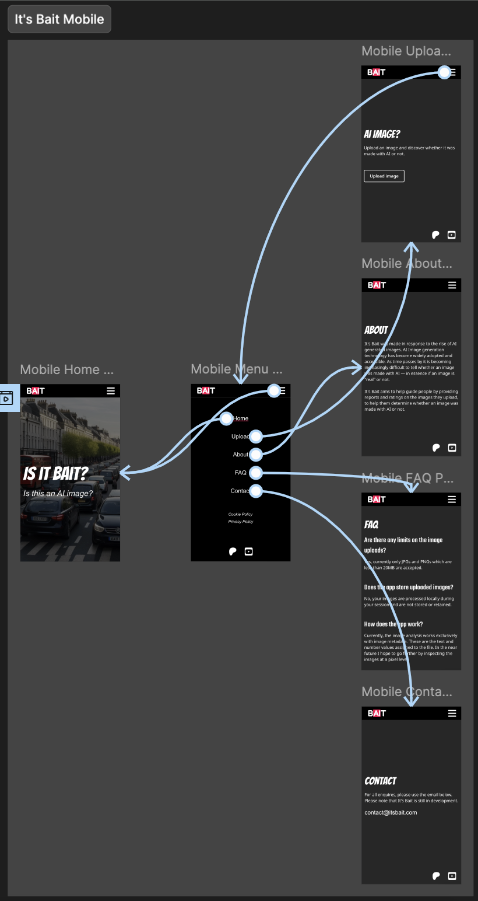
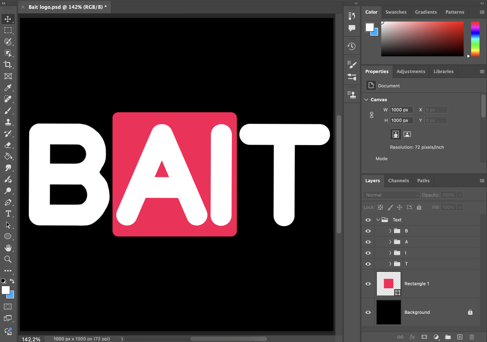

# ItsBait.com

<i>Project Screenshot (25/05/2025)</i>

 

I am currently working on an AI image detector site called [ItsBait.com](https://itsbait.com/). I began the project on the 03/03/2025.

 

## Social Links
[YouTube](https://www.youtube.com/@its_bait) 
[Patreon](https://www.patreon.com/c/Its_BAIT) 

  

## Design

### Project Design & Layout (Figma)

  
 

[Figma Project](https://www.figma.com/design/syI8LP7xcRRHivfSHIyY49/It-s-Bait?node-id=0-1&t=ol3NF4RAXrJtyyDr-1)

 

<i>Project mobile layout in Figma</i>

### Logo (Photoshop)

  
 

The project logo was designed in Photoshop. I use Photoshop because it is a familiar tool due to my background in photography. I work in a non-destructive way, taking a layered approach.  I created my own font to avoid potential future copyright issues.

<i>Project logo in Photoshop</i>

 

## Testing (Vitest)

  
 
  
In the project I am using Vitest for unit testing. The React project was built using Vite, so Vitest (which is a Vite package) seemed like the obvious choice. I have established a series of tests for the project. My tests ensure that all the different pages and their content render and that the website navigation works correctly.
    

<i>Screenshot of the test files and their results</i>

  

With Vitest you can run the tests continuously in the background. Whenever you make a change to a file the tests will run again. If the file you are working with is implicated in certain tests, then only those specific tests will run. Otherwise, all the tests will run. This means that you can work on the project and not worry about breaking things.
  

<i>Screenshot showing only relevant test files being ran</i>

  

<i>Screenshot showing the results of a single test</i>

